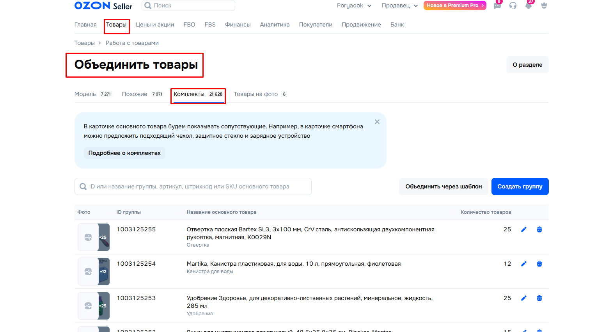
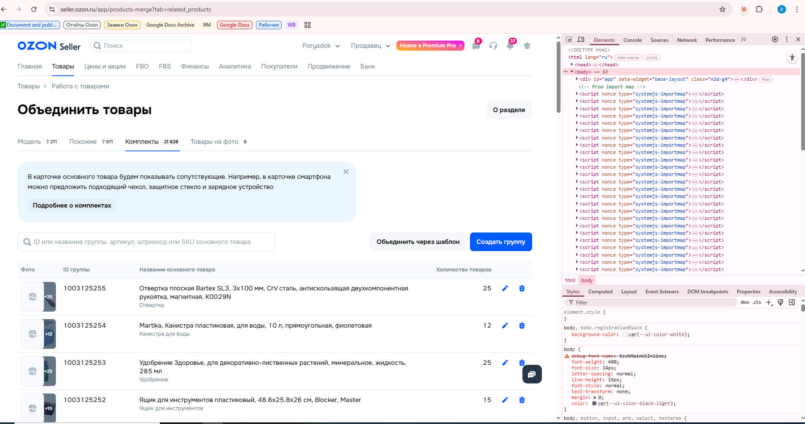
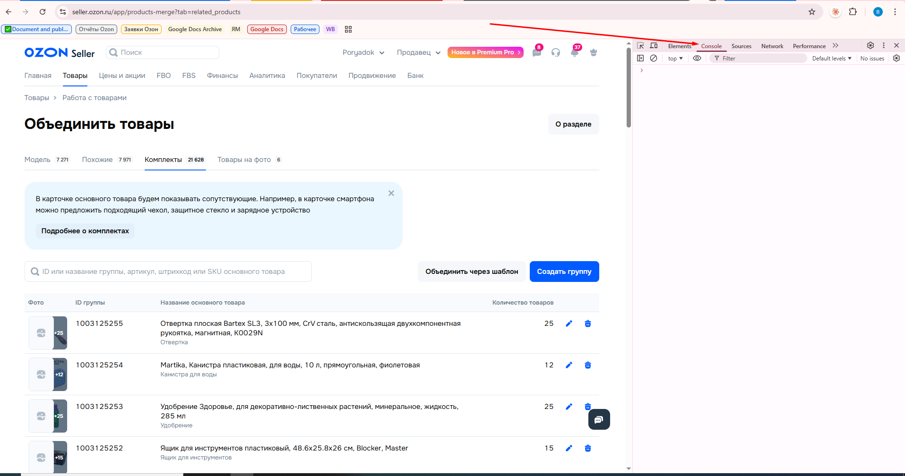
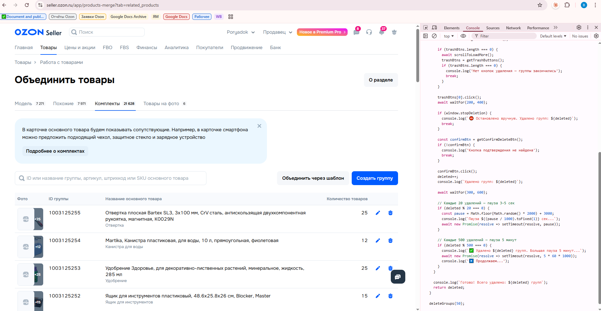
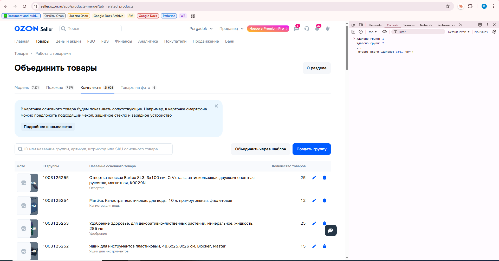

# Инструкция по удалению групп товаров в Ozon

Этот инструмент автоматически нажимает кнопку «Удалить» за вас — столько раз, сколько нужно. Вам не нужно знать программирование. Достаточно скопировать текст и вставить его в нужное место.

---

## Что понадобится

- Компьютер с браузером (Chrome, Edge или Firefox)
- Доступ в личный кабинет Ozon Seller

---

## Пошаговая инструкция

### Шаг 1. Войдите в личный кабинет Ozon

Откройте браузер и перейдите на сайт [seller.ozon.ru](https://seller.ozon.ru). Войдите в свой аккаунт продавца.

> 

---

### Шаг 2. Перейдите на страницу групп товаров

Нажмите на эту ссылку или скопируйте её в адресную строку браузера:

```
https://seller.ozon.ru/app/products-merge?tab=related_products
```

Вы должны оказаться на странице **«Объединить товары -> Комплекты»**, где отображается список групп с кнопками удаления.

> 

---

### Шаг 3. Откройте консоль разработчика

Нажмите клавишу **F12** на клавиатуре. Откроется панель разработчика — она может появиться снизу или сбоку страницы.

> 

---

### Шаг 4. Перейдите на вкладку «Console»

В верхней части открывшейся панели найдите вкладки. Нажмите на вкладку **Console** (Консоль).

> 

---

### Шаг 5. Скопируйте текст скрипта

Откройте файл **script.txt** (находится рядом с этой инструкцией).

Выделите весь текст в файле: нажмите **Ctrl + A**, затем скопируйте: **Ctrl + C**.

---

### Шаг 6. Вставьте скрипт в консоль и запустите

Кликните мышкой в поле ввода консоли (обычно это строка внизу панели, рядом со значком `>`).

Вставьте скопированный текст: **Ctrl + V**.

Нажмите **Enter**.

> 

---

### Шаг 7. Дождитесь завершения

Скрипт начнёт работу автоматически. В консоли будет появляться счётчик удалённых групп:

```
Удалено групп: 1
Удалено групп: 2
...
Готово! Всего удалено: 3301 групп
```

Не закрывайте вкладку браузера, пока скрипт не завершится.

> 

---

## Как остановить скрипт досрочно

Если нужно остановить удаление до завершения — кликните в поле консоли, введите следующий текст и нажмите **Enter**:

```
window.stopDeletion = true
```

Скрипт остановится после текущего удаления и покажет итоговый счётчик.

---

## Как изменить количество удаляемых групп

По умолчанию скрипт удалит **3301 группу**. Чтобы изменить это число:

1. Откройте файл **script.txt** в блокноте
2. Найдите самую последнюю строку:
   ```
   deleteGroups(3301);
   ```
3. Замените `3301` на нужное вам число
4. Сохраните файл и повторите шаги 5–6

---

## Важно

> ⚠️ **Удаление групп необратимо.** После запуска скрипта отменить действие невозможно. Убедитесь, что вы находитесь на правильной странице перед запуском.
